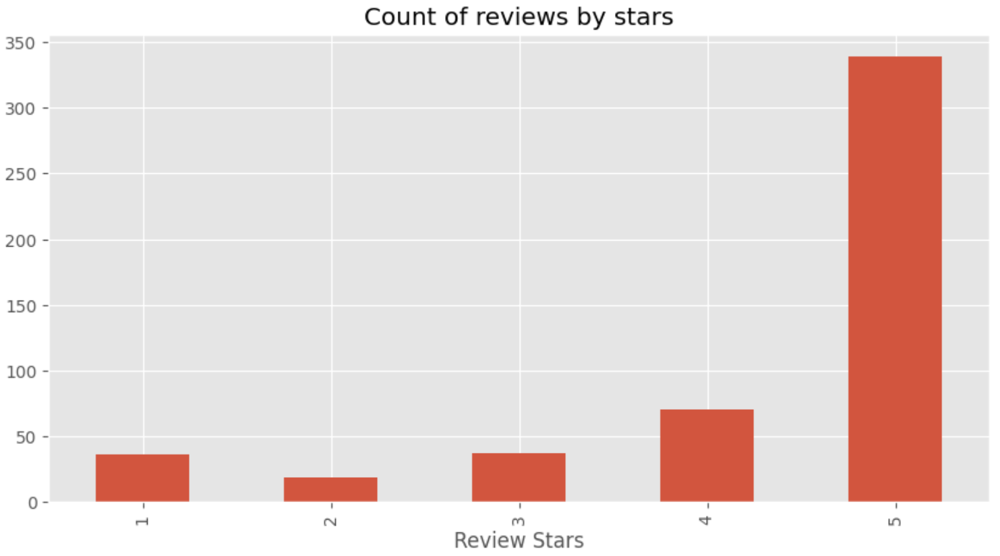
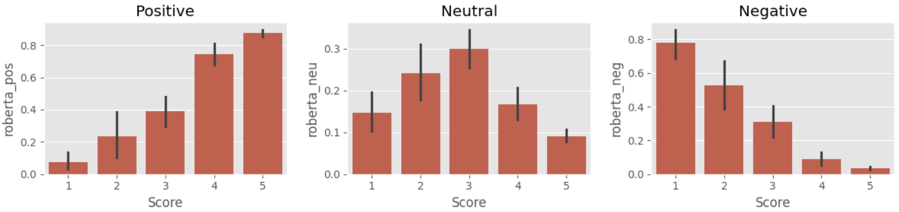

# Google_Maps_ReStar
--------------------

Employing Natural Language Processing (NLP) to re-rate restaurants using Google Maps written reviews.

## Table of Contents
--------------------
- [Data Description](#data-description)
    - [Reviews.csv](#reviews.csv)
    - [bangia_reviews.csv](#bangia_reviews.csv)
    - [bangia_reviews_processed.csv](#bangia_reviews_processed.csv)
- [Understanding RoBERTa Sentiment Analysis](#understanding-roberta-sentiment-analysis)
    - [Starting with Huggingface](#starting-with-huggingface)
    - [Original Analysis of RoBERTa](original-analysis-of-roberta)
- [Using RoBERTa Sentiment Analysis on Google Maps Customer Reviews to Re-assign Star Ratings out of 5 to Restaurants](using-roberta-sentiment-analysis-on-google-maps-customer-reviews-to-re-assign-star-ratings-out-of-5-to-restaurants)

## Data Description
-------------------

### Reviews.csv
This dataframe contains data from 568,454 Amazon reviews. We use 500 reviews in our analysis.

It contains 10 columns, but the only columns we will use are:
- `Id`: Effectively the index of the row, used for merging dataframes during processing and analysis. Int.
- `Score`: 1 to 5 star rating of the Amazon product. Int.
- `Text`: The text of the item review. String.

The Reviews.csv file too large (300 MB) to put on GitHub (limit 25 MB), so this repository has a Reviews_about.md markdown file in its place.

The dataframe Reviews.csv file can be downloaded here:
https://www.kaggle.com/code/robikscube/sentiment-analysis-python-youtube-tutorial/input

### bangia_reviews.csv
This dataframe contains 645 customer reviews for the NYC restaurant Bangia, scraped from Google Maps using the Google Maps `Places API`. \
Note: It turned out the `Places API` only returns a maximum of five reviews (there is no way around this), so the actual bangia_reviews.csv file was made using a rapid copy-paste technique.

Scraping using the API is demonstrated by the 02 - data_scraping.ipynb notebook.

We will use the 344 reviews that have written comments.

The dataframe contains 3 columns:
- `Id`: Effectively the index of the row, used for merging dataframes during processing and analysis. Int.
- `rating`: 1 to 5 star rating of the restaurant. Increments of 1 star Int.
- `text`: The text of the review. String.

### bangia_reviews_processed.csv
This dataframe contains 344 processed customer reviews for the NYC restaurant Bangia.

Processing was performed in the 03 - rerating_bangia.ipynb notebook.

The dataframe contains the 3 columns of the bangia_reviews.csv dataframe, plus 6 new columns:
- `roberta_pos`: RoBERTa sentiment analysis positive score. `roberta_pos`+`roberta_neg`+`roberta_neu`=1. Float.
- `roberta_neg`: RoBERTa sentiment analysis negative score. `roberta_pos`+`roberta_neg`+`roberta_neu`=1. Float.
- `roberta_neu`: RoBERTa sentiment analysis neutral score. `roberta_pos`+`roberta_neg`+`roberta_neu`=1. Float.
- `new_stars`: New 1 to 5 star rating of the restaurant from this review. Increments of 0.1 stars. Minimum of 1.0 stars. Int.
- `pos_neg`: First orthogonal basis vector in the `roberta_pos`+`roberta_neg`+`roberta_neu`=1 plane.`pos_neg`=`roberta_pos`-`roberta_neg`. Float.
- `pos_neg_2neu`: Second orthogonal basis vector in the `roberta_pos`+`roberta_neg`+`roberta_neu`=1 plane. `pos_neg_2neu`=`roberta_pos`+`roberta_neg`-2*`roberta_neu`. Float.

## Understanding RoBERTa Sentiment Analysis
-----------------------------------------
To reassign ratings out of 5 stars to restaurant reviews, we first need to determine how to rate the written reviews. We will use a RoBERTa model (https://arxiv.org/abs/1907.11692), a modification of the Bidirectional Encoder Representations from Transformers (BERT) model proposed by Google in 2018 (https://arxiv.org/abs/1810.04805).

RoBERTa is able to perform sentiment analysis, in which it takes in text and assigns the text a score for positive sentiment, negative sentiment, and neutral sentiment. We will call them `roberta_pos`, `roberta_neg`, and `roberta_neu` respectively. These three scores sum to 1 (`roberta_pos`+`roberta_neg`+`roberta_neu`=1).

### Starting with Huggingface
To understand how RoBERTa sentiment analysis works, we begin with the initial analysis from a Huggingface tutorial Kaggle notebook (https://www.kaggle.com/code/robikscube/sentiment-analysis-python-youtube-tutorial/notebook).

Using 500 Amazon reviews from the Reviews.csv file, we view the distribution of `Score` (1 to 5 stars):

RoBERTa sentiment analysis assigns `roberta_pos`, `roberta_neg`, and `roberta_neu` scores to each of the reviews. The left, middle, and right plots below show the average `roberta_pos`, `roberta_neu`, and `roberta_neg` scores respectively for reviews of each star rating:

### Original Analysis of RoBERTa
We would like to figure out how to re-assign star ratings out of 5 to the reviews based on these RoBERTa scores. An obvious first idea might be to assign star ratings linearly from 1 to 5 based one the value of `roberta_pos`-`roberta_neg`. We will demonstrate why this first idea is problematica better solution, and then we will present a better solution.

Because the RoBERTa scores for a sample of text always follow `roberta_pos`+`roberta_neg`+`roberta_neu`=1, all RoBERTa scores exist in this same plane in 3D space:

Takeing the `roberta_pos`, `roberta_neg`, and `roberta_neu` directions as [1 0 0], [0 1 0], and [0 0 1] respectively, our reviews all exist in the plane orthogonal to the vector [1 1 1]. Now we can find the orthogonal basis vectors in the plane.

A good choice for the horizontal basis vector would be [1 -1 0] or [-1 1 0], which would make `roberta_pos`-`roberta_neg` or `roberta_neg`-`roberta_pos`. Since it makes sense for `roberta_pos`-`roberta_neg` to be positive for reviews with more positive sentiment, we choose [1 -1 0] as our basis vector. This makes `roberta_pos`-`roberta_neg` the horizontal axis value. We make this a new variable `pos_neg` and add it to our dataframe.

We find the vertical basis vector by taking the cross product of [1 1 1] and [1 -1 0]. This gives us [1 1 -2], making `roberta_pos`+`roberta_neg`+2*`roberta_neu`. We make this a new variable `pos_neg_2neu` and add it to our dataframe.

We plot our reviews in this 2D space of `pos_neg` vs. `pos_neg_2neu`:

It is clear now the problem with scoring the reviews linearly by `roberta_pos`-`roberta_neg` value would push this data toward extreme ends of the distribution because of the sharp slopes near the ends. Let us instead try to scale the scores by distance along the distribution shape.

We see the data falls in a range of hyperbolic shapes (note that intersecting lines of reciprocal slopes form a collapsed hyperbola). The prcedure is as follows:
- We find a best fit hyperbola to the data.
- For each data point we find the closest point on the best fit line.
- Calculate the fraction of the total best fit curve length this closest point lies at, multiply by 4, and add 1. This gives a rating between 1 and 5 because Google Maps's lowest rating is 1 star.
- Round this star rating to the nearest 0.1 stars.
The results of this procedure are shown below:

Note that the values `pos_neg` vs. `pos_neg_2neu` did not need to be normalized to have a range of 1 because the star rating comes from the *fraction* of the distance along the fit curve. Rescaling by normalizing the basis values does not change fractions of lengths.

Also note that since the star scores are rounded to the nearest 0.1 stars, some data points of one color will be closer to the line of another color:

This is fine.

We plot the average Re-Star score vs. the original star score:

## Using RoBERTa Sentiment Analysis on Google Maps Customer Reviews to Re-assign Star Ratings (out of 5) to Restaurants
-----------------------------------------------------------------------------------------------------------------------
We use the same analysis on the bangia_reviews.csv dataframe, scraped from the Google Maps reviews for the NYC restaurant, Bangia.

Using 344 reviews from the bangia_reviews.csv file, we view the distribution of `Score` (1 to 5 stars):

We plot the RoBERTa sentiment analysis scores for reviews of each star rating:

We plot our reviews in the `pos_neg` vs. `pos_neg_2neu` plane:

It is clear now the problem with scoring the reviews linearly by `roberta_pos`-`roberta_neg` value would push this data toward extreme ends of the distribution because of the sharp slopes near the ends. Let us instead try to scale the scores by distance along the distribution shape.

Again, we fit the data to a hyperbola, find the nearest point on the curve for each data point, and assign a new star value from 1.0 to 5.0 accordingly:

We plot the average Re-Star score vs. the original star score:

The old rating calculated from available reviews was 4.346 stars. \
The old rating from just reviews with comments was 4.189 stars. \
**The new RoBERTa rating is 4.194 stars!**
